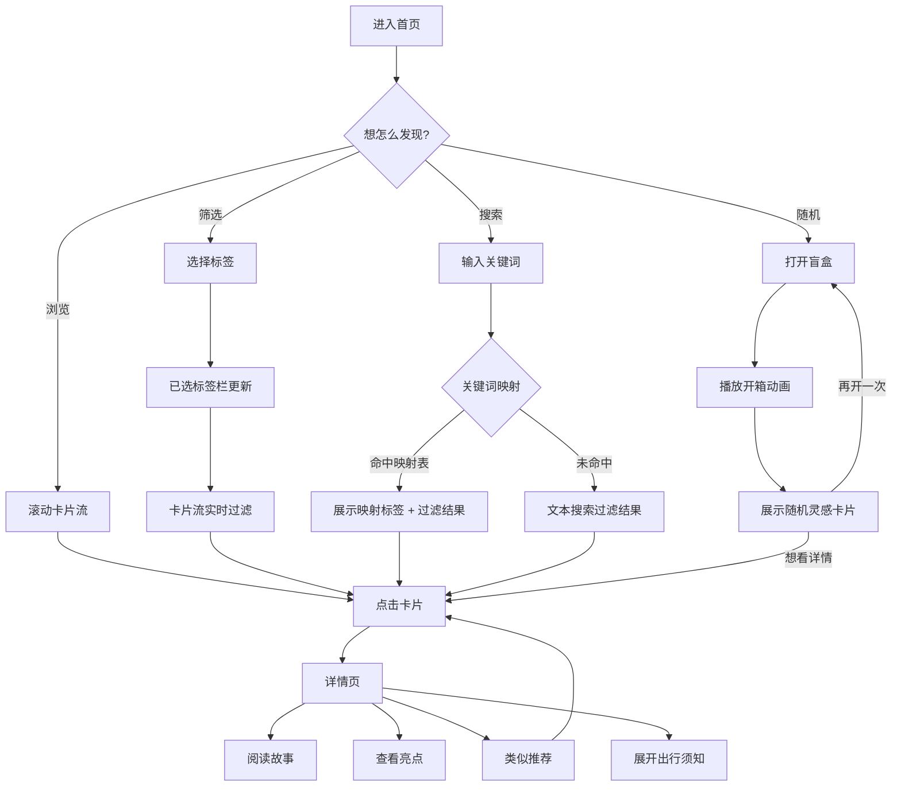
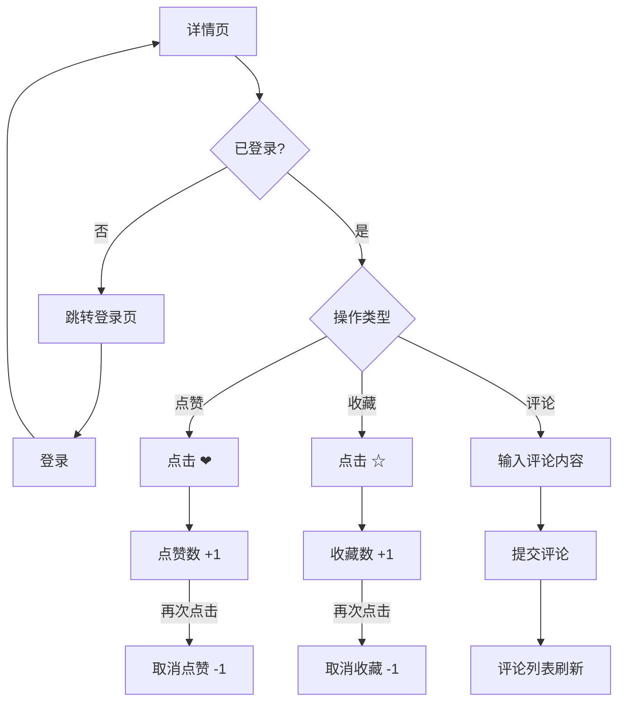
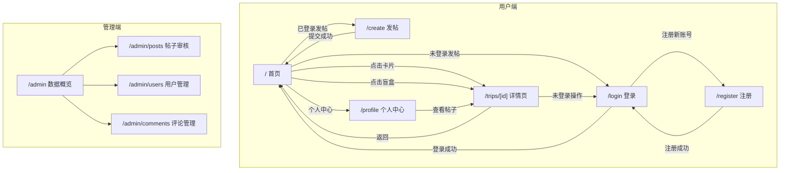

# 《100种不可思议旅行》产品需求文档 (PRD)

**版本**：v2.0 — MVP  
**状态**：已确认  
**日期**：2026-06-08  
**作者**：产品团队  

---

## 目录

1. [产品背景](#1-产品背景)
2. [产品定位](#2-产品定位)
3. [目标用户](#3-目标用户)
4. [用户痛点分析](#4-用户痛点分析)
5. [产品目标](#5-产品目标)
6. [MVP 范围](#6-mvp-范围)
7. [功能清单](#7-功能清单)
8. [内容方向](#8-内容方向)
9. [用户流程图](#9-用户流程图)
10. [页面结构图](#10-页面结构图)
11. [功能优先级](#11-功能优先级)
12. [非功能需求](#12-非功能需求)
13. [MVP 边界](#13-mvp-边界)

---

## 1. 产品背景

### 1.1 市场环境

中国在线旅行市场长期被携程、去哪儿、马蜂窝等平台主导。这些平台的核心模式是**交易导向**——帮用户订机票、订酒店、买门票。它们的内容板块（攻略、游记、问答）服务于交易转化，而非灵感发现。

与此同时，内容消费的场域已经迁移：

- 小红书上"小众景点"话题浏览量超 13.6 亿，448.8 万条讨论；
- 抖音上"探废挑战"话题播放量 12.7 亿次；
- "反向旅游"成为 2025 年国庆假期最热的旅行关键词，县域目的地订单量同比增长 51%；
- 携程报告指出，年轻用户正在"从规划路线转向表达情绪"。

**数据揭示了一个结构性缺口**：年轻用户需要一个以"灵感发现"和"情绪匹配"为核心的旅行内容平台，而不是另一个交易工具。

### 1.2 用户行为趋势

| 趋势 | 数据表现 | 意义 |
|------|---------|------|
| 反向旅游 | 县域目的地订单量同比 +51%，82% 受访者有小城旅行计划 | 用户主动逃离热门目的地 |
| 情绪消费 | 废弃矿坑年接待 30 万人次，搁浅货轮话题 38 亿播放 | 为"感觉"买单成为新常态 |
| 亚文化圈层 | 探废/暗夜/节庆/野徒社群快速壮大 | 小众玩法形成独立内容生态 |
| 表达型旅行 | 旅行成为自我表达和身份构建的一部分 | 内容即社交货币 |

### 1.3 产品机会

在"传统 OTA 太大众"和"小红书太分散"之间，存在一个明确的差异化空间：**一个以情绪和体验为核心组织逻辑、以标签为筛选维度、专注小众旅行灵感的轻量内容平台。**

---

## 2. 产品定位

**一句话定位**：以"小众玩法"和"情绪体验"为核心的旅行灵感发现平台。

**产品口号**：找到一种属于你的感觉。

**核心差异化**：

| 维度 | 传统旅行 App | 100种不可思议旅行 |
|------|------------|---------------------|
| 内容形态 | 攻略、游记、问答 | 沉浸式故事卡片 + 情绪标签 |
| 推荐逻辑 | 热度排名、算法推荐 | 标签筛选 + 关键词情绪映射 + 盲盒随机 |
| 用户心智 | "计划一次旅行" | "发现一种感觉" |
| 社交机制 | 评论、问答、结伴 | 点赞、收藏、UGC 投稿 |
| 内容来源 | 平台自产/UGC 混杂 | 官方精选 + 用户投稿（审核后上线） |

**品牌调性**：暗色、沉浸、克制、不喧嚣。用内容和情绪驱动，而非功能和促销。

---

## 3. 目标用户

### 3.1 核心用户画像

**年龄层**：95 后—00 后（19-30 岁）

**共同特征**：
- 追求小众玩法、反同质化旅行体验
- 重视视觉审美和社交表达
- 旅行决策受情绪驱动（"想要一种感觉"而非"去一个地方"）
- 愿意为独特体验付出额外时间和精力
- 有探索欲、表达欲

**典型使用场景**：
- 周五晚上刷灵感，为周末短途出行找方向
- 假期前 2-3 周搜集目的地，先找"感觉对不对"，再看实操信息
- 旅行结束后想把发现的宝藏分享出去

### 3.2 用户分层

| 用户角色 | 一句话描述 | 核心场景 | 关键诉求 | 预估占比 |
|---------|-----------|---------|---------|---------|
| **探索型玩家** | 厌倦千篇一律攻略，想找别人不知道的地方 | 周末去哪玩、假期规划 | 发现独特、反算法的灵感 | 40% |
| **氛围感收集者** | 重视情绪体验和视觉表达，旅行是为了"出片"和"感受" | 寻找有故事感、有氛围的目的地 | 视觉出片 + 情绪共鸣 | 35% |
| **分享型表达者** | 用旅行定义个人品味，分享小众经历是社交货币 | 需要可分享的旅行内容 | 社交货币 + 个性标签 | 25% |

### 3.3 典型用户故事

**小李，26 岁，设计师，base 上海：**

> "周末想出去走走，但小红书推来推去都是安吉、莫干山、乌镇。我不想去人挤人的地方，我想要那种'只有我知道'的秘境感——但问题是我真的不知道。我希望有一个 App，能让我按'孤独'和'废墟'这种感觉来搜，而不是按'杭州周边'搜。"

**小王，22 岁，大学生，base 成都：**

> "暑假想去个特别的地方拍照。朋友圈全是川西和云南，太普通了。我在 B 站刷到一个太行山废弃石屋群的视频，但信息太少——不知道具体位置、不知道危不危险、不知道值不值得去。如果有个平台能把这些'野生景点'整理清楚就好了。"

---

## 4. 用户痛点分析

| 痛点 | 严重程度 | 现状描述 | 产品解决方向 |
|------|---------|---------|------------|
| **同质化严重** | 极高 | 传统 App 推荐千篇一律，热门景点、网红打卡地重复率高 | 5 大垂直内容方向 + 多维度标签筛选 + 官方精选 |
| **发现效率低** | 高 | 小众玩法散落小红书/微博/B 站/微信群，无聚合入口 | 单一入口聚合 + 结构化卡片 + 标签关联推荐 |
| **情绪共鸣缺失** | 高 | 内容偏功能性介绍，缺乏情感连接和故事性 | 卡片以情绪标签为第一维度，故事优先于攻略 |
| **筛选维度单一** | 中 | 只能按目的地/价格/评分筛选 | 3 组标签体系（主题 × 情绪 × 等级）多选 AND 叠加 |
| **社交与内容脱节** | 中 | UGC 发布门槛高（需写长篇攻略），轻量分享无出口 | 结构化发帖表单（填空式），降低 UGC 门槛 |

---

## 5. 产品目标

### 5.1 MVP 阶段目标

**核心目标**：验证"以情绪和标签驱动的旅行灵感发现"这一核心价值主张是否成立。

**关键指标**：

| 指标 | 定义 | MVP 目标 |
|------|------|---------|
| 内容库存 | 平台可展示的旅行灵感总数 | ≥ 9 条官方内容 + 种子 UGC |
| 浏览深度 | 用户单次访问浏览的卡片数 | ≥ 5 张卡片 |
| 互动率 | 点赞/收藏占浏览量的比例 | ≥ 15%（内测用户） |
| UGC 参与 | 内测用户中至少发布 1 条投稿的比例 | ≥ 30% |
| 盲盒使用 | 至少使用 1 次盲盒功能的用户比例 | ≥ 50% |

### 5.2 Post-MVP 方向（本期不做）

- 个性化推荐算法（基于用户行为）
- 真实图片上传和 CDN
- 第三方 OAuth 登录（微信/Apple/Google）
- 旅行路线规划功能
- 用户间关注/私信
- 消息通知系统

---

## 6. MVP 范围

### 6.1 技术范围

| 项 | 说明 |
|----|------|
| 架构 | Next.js 15 全栈单体 Web App（App Router + Route Handlers） |
| 数据库 | SQLite（本地文件存储） |
| ORM | Prisma |
| 认证 | Auth.js v5 Credentials Provider（用户名 + 密码） |
| 部署 | 本地 `pnpm dev` 完整运行；Vercel 仅用于界面展示 |

### 6.2 功能范围

MVP 共包含 **13 个功能模块**，覆盖内容发现、社交互动、UGC 投稿、后台管理四个领域。

---

## 7. 功能清单

### 7.1 内容发现模块

#### F1 · 首页卡片流

**描述**：首页展示旅行灵感卡片列表，按创建时间降序排列。仅展示已审核通过的内容。

**卡片信息**：氛围占位图 + 玩法名称 + 主题标签 + 情绪标签 + 小众等级。

**交互**：点击卡片进入详情页。

#### F2 · 标签筛选

**描述**：三组标签的多行标签云，支持多选。

**筛选逻辑**：同维度选中多个 → OR；跨维度选中 → AND；未选中维度 → 不过滤。已选标签在"已选标签栏"中展示，可逐个移除或一键清除。

**标签体系**：

| 维度 | 可选值 |
|------|--------|
| 主题 | 限时仪式感 / 废墟美学 / 反向小城 / 暗夜星旅 / 野性轻探 |
| 情绪 | 孤独 / 末日感 / 荒凉 / 狂野 / 原始 / 浪漫 / 松弛 / 震撼 / 猎奇 / 怀旧 |
| 小众等级 | 只有当地人才知道 / 圈内人才懂 / 需要当地向导 / 需要特殊技能 |

#### F3 · 关键词搜索

**描述**：顶部搜索框，输入关键词后实时搜索。

**搜索机制**：
- 文本匹配：title、summary、location、highlights
- 标签匹配：theme、moodTags、rarityTag
- 关键词映射：7 组自然语言到标签的轻量映射

**关键词映射表**：

| 用户输入 | 映射标签 |
|---------|---------|
| 没人 / 人少 / 清静 / 冷门 / 小众 | 主题:反向小城 情绪:孤独,松弛,怀旧 |
| 拍照 / 出片 / 大片 / 摄影 | 主题:废墟美学,暗夜星旅 情绪:震撼,浪漫,孤独 |
| 放松 / 发呆 / 逃离 / 治愈 | 情绪:松弛,孤独,浪漫 主题:反向小城 |
| 星空 / 银河 / 夜晚 / 观星 | 主题:暗夜星旅 情绪:浪漫,震撼,孤独 |
| 刺激 / 冒险 / 野 / 探险 | 情绪:狂野,荒凉,猎奇 主题:野性轻探 |
| 废墟 / 破旧 / 末日 / 废弃 | 主题:废墟美学 情绪:末日感,怀旧,孤独 |
| 节日 / 仪式 / 传统 / 少数民族 | 主题:限时仪式感 情绪:狂野,猎奇,怀旧 |

**结果展示**："找到 X 个与「关键词」相关的玩法"，卡片标注匹配标签。无结果时展示空状态 + 推荐关键词。

#### F4 · 灵感盲盒

**描述**：首页盲盒入口，点击后播放动画（抖动→闪光→揭开），随机展示一个旅行灵感。服务端从所有 `approved` 内容中随机选取。可连续开。

#### F5 · 旅行详情页

**描述**：沉浸式内容页面，层级如下：

1. **Hero 区**：氛围头图（MVP 用 emoji 占位）+ 玩法名称 + 主题标签 + 情绪标签 + 一句话钩子
2. **故事描述**：150-220 字情绪化叙事，写画面感和为什么特别
3. **玩法亮点**：3-5 个 bullet points
4. **类似推荐**：2-3 个同主题横向卡片
5. **出行须知**（折叠）：大致区域、推荐时段/天气、难度与风险、大致花销、安全提示

**设计原则**：上半部分"种草"，下半部分"决策"。出行须知默认折叠。

---

### 7.2 社交互动模块

#### F6 · 注册与登录

**描述**：用户名 + 密码的注册和登录。用户名 3-30 字符（字母数字下划线），密码 6-100 字符。Auth.js v5 Credentials Provider 认证，JWT 存储在 HTTP-only Cookie。注册后自动登录。

#### F7 · 发帖投稿

**描述**：登录用户可提交旅行灵感。表单字段覆盖 Trip 全部必填字段。Zod 校验（类型/长度/枚举值）。新投稿默认 `pending` 状态，不出现在首页。需管理员审核通过后上线。

#### F8 · 评论

**描述**：详情页查看和发表评论。需登录。内容 1-500 字符。按时间正序排列。管理员可通过后台删除违规评论。

#### F9 · 点赞

**描述**：点赞和取消点赞。需登录。同一用户对同一内容仅可点赞一次（数据库唯一约束 + Prisma Transaction 原子更新）。乐观更新 UI，失败回滚。

#### F10 · 收藏

**描述**：收藏到个人收藏夹。需登录。同一用户对同一内容仅可收藏一次。收藏列表在 `/profile` 查看。取消收藏后从收藏夹移除。

---

### 7.3 后台管理模块

#### F11 · 数据概览

**描述**：`/admin` 首页，展示帖子总数（按状态分）、用户总数、评论总数。

#### F12 · 帖子审核

**描述**：查看待审核帖子列表，执行通过（`approved`）或拒绝（`rejected`）。可重新审核已处理帖子。仅 `admin` 角色可访问。

#### F13 · 用户与评论管理

**描述**：
- 用户管理：查看用户列表，修改角色（user ↔ admin）
- 评论管理：查看全站评论列表，删除违规评论

---

## 8. 内容方向

### 8.1 五大内容方向

| # | 方向 | 一句话描述 | 代表内容 |
|---|------|----------|---------|
| 1 | **限时仪式感** | 一年一度、不可复制的节庆和仪式体验 | 彝族阿细祭火节、赫哲族乌日贡大会 |
| 2 | **废墟美学** | 废弃空间的暗黑浪漫和美学再造 | 搁浅货轮末日大片、废弃矿坑小冰岛 |
| 3 | **反向小城** | 被忽视的县域目的地和精神修复之旅 | 中国西极落日、太行无人村 |
| 4 | **暗夜星旅** | 极致星空体验和宇宙尺度下的渺小感 | 冷湖火星营地、秦岭暗夜保护区 |
| 5 | **野性轻探** | 原始地貌的轻户外探险和秘境徒步 | 黄桑古道迷雾徒步 |

### 8.2 MVP 种子内容

| 主题 | 数量 | 示例 |
|------|------|------|
| 废墟美学 | 2 | 搁浅巨轮、矿坑小冰岛 |
| 限时仪式感 | 2 | 阿细祭火节、赫哲族乌日贡 |
| 反向小城 | 2 | 乌恰县西极、太行鸭口村 |
| 暗夜星旅 | 2 | 留坝暗夜、冷湖火星营地 |
| 野性轻探 | 1 | 黄桑古道 |

---

## 9. 用户流程图

### 9.1 核心发现流程



### 9.2 用户社交流程



### 9.3 UGC 投稿与审核流程

```mermaid
flowchart TD
    A[用户登录] --> B[进入发帖页 /create]
    B --> C[填写投稿表单]
    C --> D{Zod 校验}
    D -->|失败| E[显示字段错误提示]
    E --> C
    D -->|通过| F[提交 → status=pending]
    F --> G[提示投稿成功，等待审核]
    
    G --> H[管理员登录后台]
    H --> I[/admin/posts 审核列表]
    I --> J{审核决策}
    J -->|通过| K[status=approved → 首页可见]
    J -->|拒绝| L[status=rejected → 仅作者可见]
    
    K --> M[作者可在 /profile 看到已通过]
    L --> N[作者可在 /profile 看到已拒绝]
```

---

## 10. 页面结构图



---

## 11. 功能优先级

### P0（MVP 必须有）

| 功能 | 编号 | 理由 |
|------|------|------|
| 首页卡片流 | F1 | 核心浏览入口。没有内容流，产品不成立 |
| 标签筛选 | F2 | 核心差异化——按"感觉"筛选区别于传统 App |
| 关键词搜索 | F3 | 核心发现能力，标签筛选的高级补充 |
| 旅行详情页 | F5 | 核心消费闭环，从浏览到决策的终点 |
| 注册/登录 | F6 | UGC 和所有社交功能的前置依赖 |
| 后台帖子审核 | F12 | UGC 安全底线。没有审核，内容不可控 |

### P1（MVP 应该有）

| 功能 | 编号 | 理由 |
|------|------|------|
| 灵感盲盒 | F4 | 差异化亮点，但不是发现主路径 |
| 发帖投稿 | F7 | UGC 内容增长引擎 |
| 评论 | F8 | 社交互动基础层 |
| 点赞 | F9 | 社交互动基础层 |
| 收藏 | F10 | 社交互动基础层 + 个人中心数据源 |
| 用户管理（后台） | F13-用户 | 运营工具 |
| 评论管理（后台） | F13-评论 | 安全兜底 |

### P2（锦上添花）

| 功能 | 编号 | 理由 |
|------|------|------|
| 数据概览（后台） | F11 | 运营辅助，MVP 初期数据量小可暂缓 |

### 迭代建议

```
第 1 轮（核心闭环）: F1 + F2 + F5 + F3 + F4
第 2 轮（社交层）:   F6 + F7 + F8 + F9 + F10
第 3 轮（管理端）:   F11 + F12 + F13
```

---

## 12. 非功能需求

### 12.1 性能

| 指标 | 目标 |
|------|------|
| 首页首屏加载 (SSR) | < 2s |
| 搜索/筛选响应 | < 500ms |
| 详情页加载 (SSR) | < 1.5s |
| 点赞/收藏操作 | 乐观更新，UI 即时反馈 |
| API 响应时间 (P95) | < 500ms |

### 12.2 安全

| 措施 | 说明 |
|------|------|
| XSS 防护 | 所有用户输入渲染前转义；React 默认转义 JSX |
| CSRF 防护 | Auth.js 内置 CSRF token；SameSite Cookie |
| SQL 注入防护 | Prisma 参数化查询，无原生 SQL 拼接 |
| 密码安全 | bcryptjs 哈希（salt rounds = 10），不存储明文 |
| 权限控制 | 服务端双重校验（middleware 路由守卫 + Route Handler session/role 检查） |
| 敏感信息 | AUTH_SECRET 环境变量注入，不提交 Git |

### 12.3 可用性

| 措施 | 说明 |
|------|------|
| 空状态处理 | 搜索无结果、筛选无结果、收藏为空、盲盒池空 → 展示引导文案 + 推荐操作 |
| 错误处理 | API 失败展示友好错误提示，不暴露技术细节 |
| 加载状态 | 异步操作展示 loading 骨架屏或 spinner |
| 移动端适配 | 响应式布局，适配 375px - 1920px |
| 乐观更新 | 点赞/收藏 UI 即时响应，失败后回滚 |

### 12.4 兼容性

| 指标 | 目标 |
|------|------|
| 浏览器 | Chrome、Edge、Safari 最新两个大版本 |
| 设备 | 桌面端 + 移动端响应式 |
| 分辨率范围 | 375px - 1920px |

### 12.5 可维护性

| 措施 | 说明 |
|------|------|
| 代码规范 | TypeScript strict mode + ESLint + Prettier |
| 测试覆盖 | 核心逻辑单元测试 (Vitest) + E2E 全流程 (Playwright) |
| 文档 | SAD + PRD + SDD (data-model + schema + API contract + auth design) + DDD + README |
| Git 规范 | 每个阶段独立 commit，semantic commit message |

---

## 13. MVP 边界

### 13.1 MVP 明确包含

✅ 用户注册/登录/登出（Auth.js v5 Credentials）  
✅ 首页旅行灵感卡片流（SSR，仅展示 `approved` 内容）  
✅ 标签筛选（主题 × 情绪 × 小众等级 三维度）  
✅ 关键词搜索（7 字段 + 7 组关键词映射）  
✅ 灵感盲盒随机推荐（服务端随机选取）  
✅ 旅行详情页（Hero → 故事 → 亮点 → 类似推荐 → 出行须知折叠）  
✅ 用户发帖投稿（需登录，默认 `pending` 待审核）  
✅ 评论（需登录，1-500 字符）  
✅ 点赞/取消点赞（需登录，乐观更新 + Prisma Transaction）  
✅ 收藏/取消收藏（需登录，乐观更新 + Prisma Transaction）  
✅ 个人中心（我的收藏 + 我的帖子）  
✅ 后台管理：帖子审核（通过/拒绝）  
✅ 后台管理：用户角色管理  
✅ 后台管理：评论删除  
✅ 后台管理：数据概览  
✅ SQLite 本地数据库 + Prisma ORM  
✅ Next.js 15 全栈单体架构  

### 13.2 MVP 明确不包含

| 不做 | 原因 |
|------|------|
| 第三方 OAuth 登录（微信/Apple/Google） | 仅 Credentials，降低复杂度 |
| 真实图片上传和文件存储 | emoji 占位 + imageUrl 预留 |
| 个性化推荐算法 | 内容量小（9 条种子），算法无意义 |
| 用户间关注/私信 | 社交层 MVP 仅点赞/收藏/评论 |
| 密码找回/重置 | 不做邮件系统 |
| 手机号验证 | 不做 SMS 系统 |
| 内容编辑功能 | 发帖后不可编辑，降低审核复杂度 |
| 评论的编辑/回复/点赞 | 评论 MVP 仅发表和删除 |
| 消息通知系统 | 无关注机制，无通知场景 |
| 支付/打赏 | 不在产品定位内 |
| PWA / 离线支持 | MVP 不追求 PWA |
| 国际化 / i18n | 仅中文 |
| SSG / ISR 静态生成 | MVP 仅 SSR + CSR |
| 深度 SEO 优化 | MVP 先跑通功能 |
| 数据统计/埋点 | 非 MVP 阶段目标 |
| MapboxGL / 地图集成 | 不用复杂地图组件 |
| GSAP / 复杂动画库 | 只用 CSS 动画 |
| Supabase / 外部 BaaS | 自建 SQLite + Prisma |
| Zustand / 外部状态管理 | React Context + URL search params |
| PostgreSQL / MySQL | SQLite 零配置本地运行 |

---

## 附录 A：术语表

| 术语 | 定义 |
|------|------|
| 旅行灵感 (Trip) | 一条完整的旅行内容单元，包含标题、故事、标签、出行信息 |
| 玩法名称 | Trip 的标题，一句话钩子 |
| 情绪标签 | 描述旅行体验所唤起的情感状态的标签 |
| 小众等级 | 描述目的地的稀有程度和到达门槛 |
| 灵感盲盒 | 随机推荐功能，点击后随机展示一条旅行灵感 |
| 关键词映射 | 将自然语言输入转化为结构化标签集合的轻量规则 |
| 出行须知 | 详情页折叠区域，含地点、时间、难度、花销、安全提示 |

## 附录 B：参考竞品

| 产品 | 定位 | 差异化 |
|------|------|--------|
| 马蜂窝 | 攻略 + 交易 | 偏功能性和交易，情绪共鸣弱 |
| 小红书 | 生活方式社区 | 内容泛化，小众旅行被稀释 |
| Klook | 目的地体验预订 | 交易导向，灵感发现弱 |
| 《100种不可思议旅行》 | 情绪驱动的旅行灵感发现 | 专注小众玩法 + 情绪标签体系 + 无交易噪音 |

---

> **文档变更记录**  
> v2.0 — 2026-06-08 — 完整 PRD：13 章节，含 Mermaid 用户流程图、页面结构图  
> v1.0 — 2026-06-08 — 初始版本
