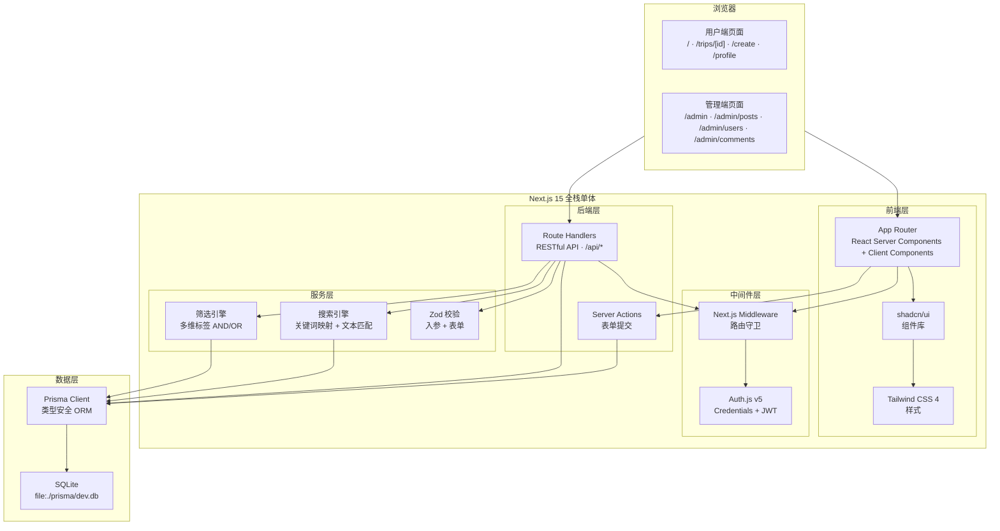
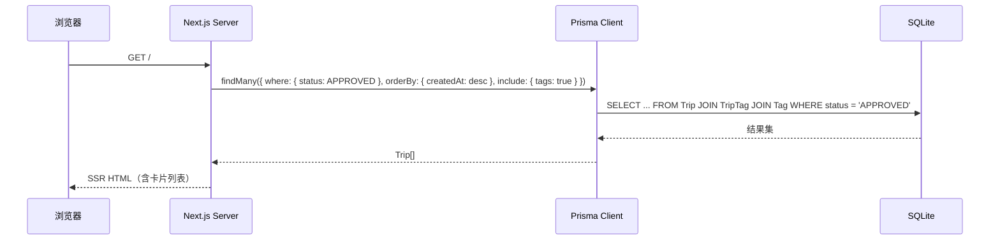
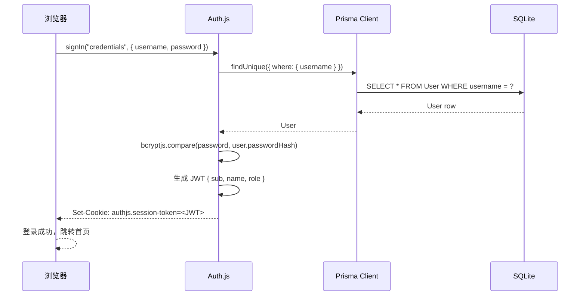
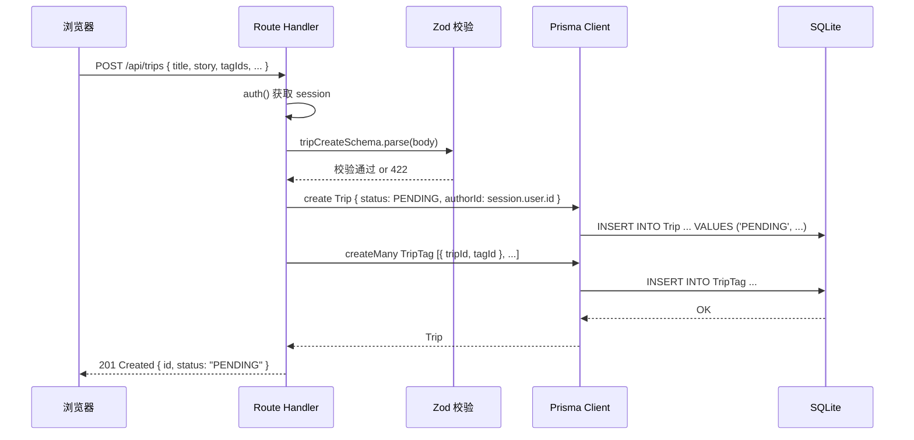
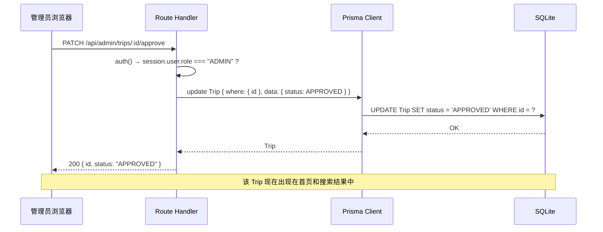
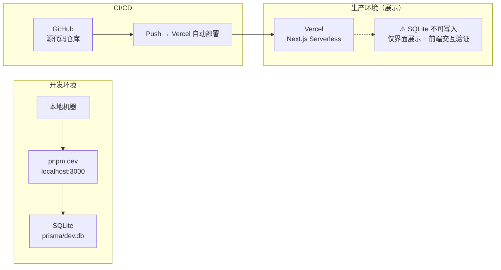

# 软件架构设计文档 (SAD)

## 「100种不可思议旅行」

**版本**：v1.0 — MVP  
**日期**：2026-06-09  
**受众**：开发团队  
**来源**：docs/PRD.md · docs/ERD.md · docs/API_CONTRACT.md · prisma/schema.prisma

---

## 目录

1. [系统目标](#1-系统目标)
2. [整体架构](#2-整体架构)
3. [技术选型](#3-技术选型)
4. [项目目录结构](#4-项目目录结构)
5. [数据流设计](#5-数据流设计)
6. [权限设计](#6-权限设计)
7. [API 架构](#7-api-架构)
8. [数据库架构](#8-数据库架构)
9. [安全设计](#9-安全设计)
10. [部署架构](#10-部署架构)
11. [MVP 后续扩展方向](#11-mvp-后续扩展方向)

---

## 1. 系统目标

### 1.1 项目定位

《100种不可思议旅行》是一个以"小众玩法"和"情绪体验"为核心的旅行灵感发现平台。与传统 OTA（交易导向）和小红书（泛内容社区）不同，本系统通过**情绪标签 + 主题分类 + 小众等级**三维筛选体系，帮助年轻用户以"感觉"为入口发现旅行灵感。

### 1.2 MVP 范围

**用户端（6 个页面）：**

| 页面 | 路由 | 说明 |
|------|------|------|
| 首页 | `/` | 卡片流 + 搜索 + 标签筛选 + 盲盒入口 |
| 详情页 | `/trips/[id]` | Hero → 故事 → 亮点 → 评论 → 出行须知 |
| 登录 | `/login` | 用户名 + 密码登录 |
| 注册 | `/register` | 注册新账户 |
| 发帖 | `/create` | 结构化表单提交旅行灵感 |
| 个人中心 | `/profile` | 我的收藏 + 我的帖子 |

**管理端（4 个页面）：**

| 页面 | 路由 | 说明 |
|------|------|------|
| 数据概览 | `/admin` | 帖子/用户/评论统计 |
| 帖子审核 | `/admin/posts` | PENDING → APPROVED / REJECTED |
| 用户管理 | `/admin/users` | 角色变更 USER ↔ ADMIN |
| 评论管理 | `/admin/comments` | 查看 + 删除违规评论 |

**API（33 个端点）：** 覆盖认证/灵感/标签/评论/点赞/收藏/个人中心/后台管理 8 个模块。

### 1.3 非目标范围

- 第三方 OAuth 登录
- 图片上传（MVP 用 emoji + URL 占位）
- 个性化推荐算法
- 关注/粉丝/私信/通知
- PWA / 离线模式
- 全文/语义搜索
- 支付/商业化
- 国际化

---

## 2. 整体架构



**架构要点：**

- **单仓库单体**：前端和后端在一个 Next.js 项目中，无需独立 API 服务器
- **App Router**：使用 React Server Components 做 SSR，Client Components 做交互
- **Route Handlers**：所有 API 通过 `/api/*` 路径的 `route.ts` 文件实现
- **中间件守卫**：`middleware.ts` 处理路由级别的认证检查，API 内部二次校验权限
- **Auth.js**：位于中间件层，拦截请求 → 验证 JWT → 注入 session

---

## 3. 技术选型

### 3.1 为什么选择 Next.js 15

| 原因 | 说明 |
|------|------|
| **全栈能力** | App Router 同时承载页面渲染和 API 路由，无需拆分前后端项目 |
| **SSR 开箱即用** | 首页和详情页服务端渲染，SEO 友好 + 首屏加载快 |
| **Server Components** | 数据查询在服务端完成，减少客户端 JS 体积 |
| **Route Handlers** | 替代传统 Express API，与项目结构统一 |
| **Vercel 原生支持** | 一键部署，零配置 |
| **生态完整** | Auth.js、Prisma、Tailwind 均有成熟的 Next.js 集成方案 |

**MVP 决策**：Next.js 单体架构避免了前后端分离带来的项目管理和部署复杂度，一人开发团队可高效迭代。

### 3.2 为什么选择 Prisma

| 原因 | 说明 |
|------|------|
| **类型安全** | Schema 自动生成 TypeScript 类型，编译期发现错误 |
| **迁移管理** | `prisma migrate dev` 自动跟踪 Schema 变更 |
| **关系查询** | 嵌套 `include` / `select` 语法简洁，替代手写 JOIN |
| **SQLite 支持** | 对 SQLite 的支持成熟稳定 |

### 3.3 为什么选择 SQLite

| 原因 | 说明 |
|------|------|
| **零配置** | 无需安装数据库服务，一个文件即数据库 |
| **本地优先** | MVP 目标是在本地跑通完整功能，SQLite 是最轻的选择 |
| **Prisma 兼容** | Prisma 对 SQLite 的支持足够 MVP 使用 |
| **迁移路径** | 后续可平滑迁移至 Turso（SQLite 兼容云服务）或 PostgreSQL |

**限制认知**：SQLite 不支持并发写入（写锁），不支持原生 JSON 列。MVP 阶段数据量和并发量极小，这些限制不构成瓶颈。

### 3.4 为什么选择 Auth.js v5

| 原因 | 说明 |
|------|------|
| **Next.js 原生集成** | `auth()` 在 Server Component 和 Route Handler 中直接调用 |
| **Credentials Provider** | 支持用户名 + 密码登录，无需第三方 OAuth |
| **JWT 策略** | 无需数据库 Session 表，减少状态管理 |
| **中间件支持** | `middleware.ts` 中直接使用 `auth()` 做路由守卫 |

### 3.5 为什么选择 Vercel

| 原因 | 说明 |
|------|------|
| **Next.js 原厂** | 对 Next.js 15 特性的支持最完整 |
| **零配置部署** | 连接 GitHub 仓库即可自动部署 |
| **免费层** | MVP 阶段流量小，免费层足够 |

**重要说明**：Vercel Serverless 环境不支持 SQLite 持久化写入。Vercel 部署仅用于界面展示和前端交互验证。完整功能需本地运行 `pnpm dev`。

### 3.6 MVP 技术选型原则

- **单体优先**：不拆微服务，不引入消息队列
- **本地优先**：SQLite 文件数据库，零运维
- **类型优先**：TypeScript + Prisma + Zod = 全链路类型安全
- **简单优先**：不做过度抽象，不用状态管理库（Context 足够）

---

## 4. 项目目录结构

```
xiyouji/
├── prisma/                        # 数据库层
│   ├── schema.prisma              #   Prisma 数据模型（7个模型，3个枚举）
│   ├── seed.ts                    #   种子数据脚本
│   └── migrations/                #   迁移文件（自动生成）
│
├── src/
│   ├── app/                       # Next.js App Router（页面 + API）
│   │   ├── layout.tsx             #   根布局
│   │   ├── page.tsx               #   首页 /
│   │   ├── trips/
│   │   │   └── [id]/
│   │   │       └── page.tsx       #   详情页 /trips/[id]
│   │   ├── create/
│   │   │   └── page.tsx           #   发帖页 /create
│   │   ├── login/
│   │   │   └── page.tsx           #   登录页 /login
│   │   ├── register/
│   │   │   └── page.tsx           #   注册页 /register
│   │   ├── profile/
│   │   │   └── page.tsx           #   个人中心 /profile
│   │   ├── admin/
│   │   │   ├── layout.tsx         #   管理端布局 + 权限守卫
│   │   │   ├── page.tsx           #   数据概览 /admin
│   │   │   ├── posts/
│   │   │   │   └── page.tsx       #   帖子审核 /admin/posts
│   │   │   ├── users/
│   │   │   │   └── page.tsx       #   用户管理 /admin/users
│   │   │   └── comments/
│   │   │       └── page.tsx       #   评论管理 /admin/comments
│   │   └── api/                   #   API Route Handlers
│   │       ├── auth/
│   │       │   ├── [...nextauth]/route.ts
│   │       │   ├── register/route.ts
│   │       │   └── me/route.ts
│   │       ├── trips/
│   │       │   ├── route.ts
│   │       │   ├── filter/route.ts
│   │       │   ├── search/route.ts
│   │       │   └── [id]/
│   │       │       ├── route.ts
│   │       │       ├── comments/route.ts
│   │       │       ├── like/route.ts
│   │       │       └── favorite/route.ts
│   │       ├── tags/route.ts
│   │       ├── blindbox/route.ts
│   │       ├── comments/[id]/route.ts
│   │       ├── profile/
│   │       │   ├── route.ts
│   │       │   ├── trips/route.ts
│   │       │   └── favorites/route.ts
│   │       └── admin/
│   │           ├── stats/route.ts
│   │           ├── trips/
│   │           │   ├── route.ts
│   │           │   └── [id]/
│   │           │       ├── approve/route.ts
│   │           │       ├── reject/route.ts
│   │           │       └── route.ts
│   │           ├── users/
│   │           │   ├── route.ts
│   │           │   └── [id]/role/route.ts
│   │           └── comments/
│   │               ├── route.ts
│   │               └── [id]/route.ts
│   │
│   ├── lib/                       # 服务层
│   │   ├── prisma.ts              #   Prisma Client 单例
│   │   ├── auth.ts                #   auth() / signIn / signOut 导出
│   │   ├── auth.config.ts         #   Auth.js 配置
│   │   ├── validations.ts         #   Zod Schema 集合
│   │   ├── search.ts              #   搜索引擎 + 关键词映射表
│   │   └── constants.ts           #   标签枚举 / 映射表 / 默认值
│   │
│   ├── components/                # 组件层
│   │   ├── ui/                    #   通用 UI 组件（shadcn/ui 扩展）
│   │   │   ├── TripCard.tsx       #     旅行卡片
│   │   │   ├── TagChip.tsx        #     标签 Chip
│   │   │   ├── FilterCloud.tsx    #     标签云筛选器
│   │   │   ├── SearchBar.tsx      #     搜索栏
│   │   │   ├── BlindBox.tsx       #     盲盒组件
│   │   │   ├── LikeButton.tsx     #     点赞按钮
│   │   │   ├── FavoriteButton.tsx #     收藏按钮
│   │   │   ├── CommentSection.tsx #     评论区
│   │   │   └── EmptyState.tsx     #     空状态
│   │   ├── layout/                #   布局组件
│   │   │   ├── Header.tsx         #     顶部导航
│   │   │   └── AdminSidebar.tsx   #     管理端侧边栏
│   │   └── forms/                 #   表单组件
│   │       ├── LoginForm.tsx      #     登录表单
│   │       ├── RegisterForm.tsx   #     注册表单
│   │       └── CreateTripForm.tsx #     发帖表单
│   │
│   └── middleware.ts              # Next.js Middleware（路由守卫）
│
├── tests/                         # 测试
│   ├── unit/                      #   Vitest 单元测试
│   ├── integration/               #   Vitest 集成测试
│   └── e2e/                       #   Playwright E2E 测试
│
├── docs/                          # 文档
│   ├── PRD.md                     #   产品需求文档
│   ├── ERD.md                     #   实体关系设计
│   ├── API_CONTRACT.md            #   API 契约
│   └── SAD.md                     #   软件架构设计（本文档）
│
├── scripts/                       # 开发辅助脚本
│   └── check-seed.ts              #   数据库种子数据验证脚本
│
├── public/                        # 静态资源
│   └── images/                    #   氛围图（后续替换）
│
├── .env.local                     # 环境变量（DATABASE_URL / AUTH_SECRET）
├── .env.example
├── next.config.ts
├── tailwind.config.ts
├── tsconfig.json
├── vitest.config.ts
├── playwright.config.ts
├── package.json
└── README.md
```

**各目录职责：**

| 目录 | 职责 | 原则 |
|------|------|------|
| `src/app/` | 页面路由 + API 端点 | 遵循 Next.js App Router 文件约定 |
| `src/lib/` | 服务层：Prisma、Auth、校验、搜索引擎 | 纯逻辑，不含 JSX |
| `src/components/ui/` | 通用 UI 组件 | 无业务逻辑依赖，可独立测试 |
| `src/components/forms/` | 表单组件 | 封装 Zod 校验 + Server Action |
| `src/components/layout/` | 布局组件 | 跨页面共享 |
| `prisma/` | 数据库 Schema + 迁移 + 种子 | 数据库单一事实来源 |
| `docs/` | 项目文档 | PRD/ERD/API/SAD 独立文件 |
| `tests/` | 测试代码 | 按测试类型分层 |
| `scripts/` | 开发辅助脚本 | `check-seed.ts` 是数据库种子数据验证脚本，用于在执行 `prisma/seed.ts` 后检查用户、标签、Trip、评论、点赞、收藏等种子数据是否完整，确保数据库初始化结果符合黑客松交付要求 |

---

## 5. 数据流设计

### 5.1 用户浏览内容（首页 SSR）



### 5.2 用户登录



### 5.3 用户投稿



### 5.4 管理员审核



---

## 6. 权限设计

### 6.1 角色定义

| 角色 | 枚举值 | 获取方式 | 说明 |
|------|--------|---------|------|
| 未登录用户 | — | 默认 | 可浏览、搜索、查看详情 |
| USER | `UserRole.USER` | 注册后默认 | 可发帖、评论、点赞、收藏 |
| ADMIN | `UserRole.ADMIN` | 数据库直接修改 | 可审核帖子、管理用户、删除评论 |

> MVP 仅支持两级角色。通过 `prisma/seed.ts` 创建首个 ADMIN 账户，后续由 ADMIN 通过 `/admin/users` 将其他用户提升为 ADMIN。

### 6.2 权限矩阵

```
操作                     未登录      USER        ADMIN
───────────────────────  ────────  ────────  ────────
浏览首页 / 搜索 / 筛选     ✅         ✅         ✅
查看详情页                 ✅         ✅         ✅
注册 / 登录                ✅         —          —
发帖                       —         ✅         ✅
编辑自己的帖子              —         ✅         ✅
删除自己的帖子              —         ✅         ✅
发表评论                   —         ✅         ✅
删除自己的评论              —         ✅         ✅
点赞 / 取消点赞            —         ✅         ✅
收藏 / 取消收藏            —         ✅         ✅
查看个人资料               —         ✅         ✅
修改个人资料               —         ✅         ✅

审核帖子 (approve/reject)   —         —         ✅
删除任何帖子                —         —         ✅
删除任何评论                —         —         ✅
修改用户角色                —         —         ✅
访问 /admin/*               —         —         ✅
```

### 6.3 权限检查层级

```
Layer 1: Next.js Middleware (middleware.ts)
  → 拦截 /admin/* /create /profile 路由
  → 未登录 → 重定向 /login
  → 访问 /admin/* 但 role ≠ ADMIN → 重定向 /

Layer 2: Route Handler (每个 API 端点)
  → auth() 获取 session
  → session === null → 401
  → 需要 ADMIN 但 session.user.role ≠ "ADMIN" → 403
  → 需要作者权限但 session.user.id ≠ trip.authorId → 403

Layer 3: 数据库约束 (Prisma Schema)
  → Like/Favorite @@unique([userId, tripId]) → 重复操作返回 409
  → Trip.authorId FK → 保证数据归属
```

---

## 7. API 架构

### 7.1 Route Handlers

所有 API 通过 Next.js Route Handlers 实现，文件位于 `src/app/api/*/route.ts`。

**示例结构：**

```typescript
// src/app/api/trips/route.ts
import { auth } from "@/lib/auth"
import { prisma } from "@/lib/prisma"
import { tripCreateSchema } from "@/lib/validations"

export async function GET(request: Request) {
  // 公开接口，无需认证
  const { searchParams } = new URL(request.url)
  // ... 查询逻辑
  return NextResponse.json({ data, message: "ok" })
}

export async function POST(request: Request) {
  const session = await auth()
  if (!session) return NextResponse.json({ error: ... }, { status: 401 })

  const body = await request.json()
  const parsed = tripCreateSchema.safeParse(body)
  if (!parsed.success) return NextResponse.json({ error: ... }, { status: 422 })

  const trip = await prisma.trip.create({ data: { ...parsed.data, authorId: session.user.id } })
  return NextResponse.json({ data: trip, message: "投稿成功" }, { status: 201 })
}
```

### 7.2 RESTful API 设计原则

| 原则 | 说明 |
|------|------|
| 资源路径用复数名词 | `/api/trips`, `/api/tags`, `/api/comments` |
| HTTP Method 表达操作 | GET 查询, POST 创建, PATCH 修改, DELETE 删除 |
| 子资源嵌套 | `/api/trips/:id/comments` |
| 少数 RPC 风格路径 | `/api/blindbox`, `/api/trips/search`, `/api/admin/stats` |
| 统一的 JSON 响应格式 | `{ data, message }` 或 `{ data, total, page, pageSize, message }` |
| 统一的错误格式 | `{ error: { code, message } }` |

### 7.3 API 分层原则

```
Route Handler (route.ts)
  ├── 认证检查 (auth())
  ├── 权限检查 (role / authorId)
  ├── 入参校验 (Zod)
  └── 调用服务层
        └── 服务层 (src/lib/*.ts)
              ├── 业务逻辑
              └── 调用 Prisma
                    └── Prisma → SQLite
```

- **Route Handler** 负责：认证、权限、校验、HTTP 响应
- **服务层** (`src/lib/`) 负责：业务逻辑、数据查询、搜索引擎
- **Prisma** 负责：数据持久化、关系查询

### 7.4 服务层职责

| 文件 | 职责 |
|------|------|
| `lib/prisma.ts` | Prisma Client 单例导出 |
| `lib/auth.ts` | `auth()` / `signIn()` / `signOut()` 导出 |
| `lib/auth.config.ts` | Auth.js 配置（Credentials Provider, JWT, callbacks） |
| `lib/validations.ts` | 所有 Zod Schema：注册/登录/发帖/评论/资料修改 |
| `lib/search.ts` | 搜索引擎：关键词映射函数 + 文本匹配 + 标签匹配 |
| `lib/constants.ts` | 常量：标签枚举值、关键词映射表、默认 emoji 列表 |

---

## 8. 数据库架构

### 8.1 核心实体（7 个模型）

| 模型 | 用途 | 关键约束 |
|------|------|---------|
| `User` | 用户账户 | `username @unique`, `role` 枚举 |
| `Trip` | 旅行灵感 | `authorId` FK, `status` 枚举, `likeCount`/`favoriteCount` 冗余 |
| `Tag` | 标签字典 | `name @unique`, `type` 枚举 (THEME/MOOD/LEVEL) |
| `TripTag` | Trip-Tag M2M | 联合主键 `@@id([tripId, tagId])` |
| `Comment` | 评论 | `tripId` FK CASCADE, `@@index([tripId])` |
| `Like` | 点赞 | `@@unique([userId, tripId])`, tripId FK CASCADE |
| `Favorite` | 收藏 | `@@unique([userId, tripId])`, tripId FK CASCADE |

### 8.2 索引策略

| 索引 | 类型 | 用途 |
|------|------|------|
| `Trip.theme` | `@@index` | 按主题筛选 |
| `Trip.status` | `@@index` | 仅查询 APPROVED 内容（最频繁的过滤条件） |
| `Trip.authorId` | `@@index` | 查询用户发帖列表 |
| `Trip.createdAt` | `@@index` | 按时间排序 |
| `Comment.tripId` | `@@index` | 查询某 Trip 的评论列表 |
| `User.username` | `@unique` (自动索引) | 登录查询 |
| `Like.userId_tripId` | `@@unique` (自动复合索引) | 点赞去重 + 快速查询点赞状态 |
| `Favorite.userId_tripId` | `@@unique` (自动复合索引) | 收藏去重 + 快速查询收藏状态 |

### 8.3 级联删除策略

```
删除 Trip
  → CASCADE 删除 TripTag  （清理标签关联）
  → CASCADE 删除 Comment  （清理评论）
  → CASCADE 删除 Like     （清理点赞）
  → CASCADE 删除 Favorite （清理收藏）

删除 Tag
  → CASCADE 删除 TripTag  （清理关联，不删除 Trip）

删除 User
  → 默认 RESTRICT          （如果有关联数据，拒绝删除）
  → 建议：管理员先手动处理用户帖子，再删除用户
```

> **注**：本文档不重复 ERD 中的字段定义，完整实体关系参见 [docs/ERD.md](./ERD.md)。

---

## 9. 安全设计

### 9.1 密码安全

| 措施 | 实现 |
|------|------|
| 哈希算法 | bcryptjs，salt rounds = 10 |
| 存储 | 仅存 `passwordHash`，不存明文 |
| 传输 | 通过 HTTPS POST body 传输（本地开发 HTTP） |
| 登录失败 | 统一返回 "用户名或密码错误"，不区分用户不存在和密码错误 |

### 9.2 Session 安全

| 措施 | 实现 |
|------|------|
| Token 类型 | JWT，由 Auth.js 签发和管理 |
| 存储位置 | HTTP-only Cookie（JavaScript 不可访问） |
| Cookie 属性 | `httpOnly: true`, `secure: true`（生产环境 HTTPS）, `sameSite: "lax"` |
| 过期时间 | Auth.js `session.maxAge` 默认 30 天 |
| CSRF 保护 | Auth.js 内置 CSRF token 验证 |

### 9.3 输入校验

| 层 | 机制 | 覆盖 |
|----|------|------|
| 客户端 | Zod Schema → 表单实时校验提示 | 格式/长度/枚举值 |
| 服务端 | Zod Schema → Route Handler 入口校验 | 所有 API 入参 |
| 数据库 | Prisma 参数化查询 | SQL 注入免疫 |

**所有用户输入必须经过 Zod 校验：**

- 注册/登录 → `authSchema`
- 发帖 → `tripCreateSchema`
- 编辑帖子 → `tripUpdateSchema`
- 评论 → `commentSchema`
- 修改资料 → `profileUpdateSchema`

### 9.4 权限校验

```
请求 → middleware.ts (路由守卫)
     → Route Handler:
         auth()        → 检查登录状态
         role 检查      → 检查 ADMIN 权限
         authorId 检查  → 检查资源所有权
     → 业务逻辑
```

权限检查在**服务端**完成，不依赖客户端隐藏 UI（客户端仅做体验优化，不做安全控制）。

### 9.5 XSS / 注入防护

| 威胁 | 防护措施 |
|------|---------|
| XSS | React 默认转义 JSX 输出；`dangerouslySetInnerHTML` 禁用 |
| SQL 注入 | Prisma 参数化查询；不使用 `$queryRaw` |
| CSRF | Auth.js 内置 CSRF token；SameSite Cookie |
| 敏感信息泄露 | AUTH_SECRET / DATABASE_URL 通过环境变量注入，不提交 Git |
| 枚举攻击 | 登录失败不区分"用户不存在"和"密码错误" |

---

## 10. 部署架构



### 10.1 开发环境

```bash
pnpm install
npx prisma migrate dev --name init
npx prisma db seed
pnpm dev
# → http://localhost:3000
# 完整功能：读写 SQLite，所有 API 可用
```

**环境变量 (`.env.local`)：**

```bash
DATABASE_URL="file:./prisma/dev.db"
AUTH_SECRET="<openssl rand -base64 32>"
AUTH_URL="http://localhost:3000"
```

### 10.2 Vercel 展示部署

- 连接 GitHub 仓库 → Vercel 自动构建和部署
- **限制**：Serverless 函数运行时不保证文件系统持久化，SQLite 写入可能在请求间丢失
- **可用功能**：页面浏览、SSR 渲染、前端交互
- **不可用功能**：注册、发帖、评论、点赞、收藏、审核（均需写入数据库）
- **用途**：界面展示、前端交互验证、SSR 测试

### 10.3 生产环境持久化方案（MVP 后）

| 方案 | 改动 | 说明 |
|------|------|------|
| **Turso** | 改 `DATABASE_URL` | SQLite 兼容云服务，Prisma 适配器，边缘部署 |
| **Docker + Volume** | 添加 `Dockerfile` | Next.js standalone + SQLite 挂载卷 |
| **PostgreSQL** | 改 `datasource.provider` | 全功能关系数据库，适合高并发场景 |

---

## 11. MVP 后续扩展方向

以下方向**不在 MVP 范围内**，但架构已预留扩展空间：

### 11.1 搜索优化

- **现状**：轻量关键词映射 + LIKE 文本匹配
- **方向**：引入 SQLite FTS5 全文搜索，或迁移至 PostgreSQL 后使用 `tsvector`
- **前置条件**：内容量 > 100 条后才有优化必要

### 11.2 个性化推荐

- **现状**：无推荐算法，按时间倒序 + 标签筛选 + 盲盒随机
- **方向**：基于用户点赞/收藏历史的协同过滤，或基于标签的相似内容推荐
- **数据前置条件**：需要用户行为数据积累（DAU > 100, 行为 > 1000 条/天）

### 11.3 地图模式

- **现状**：无地图展示
- **方向**：为 Trip 添加经纬度字段，使用 Leaflet（轻量替代 MapboxGL）实现地图浏览模式
- **Schema 变更**：Trip 表增加 `lat` / `lng` 可选字段

### 11.4 用户关注系统

- **现状**：无用户间关系
- **方向**：增加 Follow 模型（followerId + followingId），实现关注/取关 + 关注流
- **Schema 变更**：新增 Follow 表，新增通知系统

### 11.5 图片存储升级

- **现状**：emoji 占位 + imageUrl 预留字段
- **方向**：接入 Vercel Blob 或 Cloudflare R2 存储用户上传图片，Trip 支持多图
- **Schema 变更**：Trip.imageUrl 从单 URL 改为 JSON 数组，或新增 TripImage 表

### 11.6 数据库迁移

- **现状**：SQLite
- **方向**：迁移至 PostgreSQL（通过 Prisma 改 datasource + 数据迁移脚本）
- **触发条件**：需要高并发写入、全文搜索、地理空间查询时

---

> **配套文档**：[PRD](./PRD.md) | [ERD](./ERD.md) | [API Contract](./API_CONTRACT.md) | [Prisma Schema](../prisma/schema.prisma)
